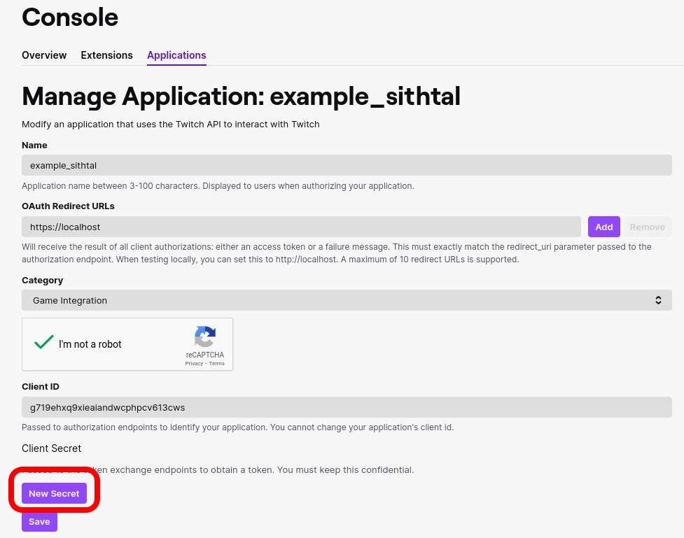
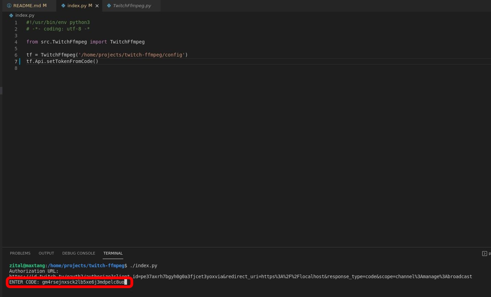

# twitch-ffmpeg
twitch-ffmpeg: stream through ffmpeg on twitch

# 1: Create APP 

Go to: **https://dev.twitch.tv/console/apps**





# 2: Create twitch_client.json

```
{
	"client_id": "g719ehxq9xieaiandwcphpcv613cws",
	"client_secret": "vek7nwmh53klnrtj7zpizj53q99f56"
}
```

# 3: Get CODE to create TOKEN

```
#!/usr/bin/env python3
# -*- coding: utf-8 -*

from src.TwitchFfmpeg import TwitchFfmpeg

tf = TwitchFfmpeg('/home/projects/twitch-ffmpeg/config')
tf.Api.setTokenFromCode()
```




# 4: Set CHANNEL information

## 4.1: Set Channel name:
Your nick from twitch, for example: **sithtal** https://twitch.tv/sithtal

## 4.2: get Channel KEY:

Go to: https://dashboard.twitch.tv/u/{your_channel}/settings/stream for example: **https://dashboard.twitch.tv/u/sithtal/settings/stream**

COPY **Primary Stream key**

## 4.3: Get STREAM URL:

Go to: https://stream.twitch.tv/ingests/ and get desired end point server url without **{stream_key}**, for example: **rtmp://mad01.contribute.live-video.net/app/**

## 4.4: Set All information together:

Open **twitch_channel.json** and replace values, for example:

```
{
	"channel":	"sithtal",
	"key":		"live_123456789_ABCDEFGHGIJKLMNOPQRS1aBCdEFGH2i",
	"server":	"rtmp://mad01.contribute.live-video.net/app/"
}

```

# 4: Refresh TOKEN

The TOKEN expires, to refresh token create a cron to refresh it

```
#!/usr/bin/env python3
# -*- coding: utf-8 -*

from src.TwitchFfmpeg import TwitchFfmpeg

tf = TwitchFfmpeg('/home/projects/twitch-ffmpeg/config')
tf.Api.refreshToken()
```

# 5: Change Stream title

```
#!/usr/bin/env python3
# -*- coding: utf-8 -*

from src.TwitchFfmpeg import TwitchFfmpeg

tf = TwitchFfmpeg('/home/projects/twitch-ffmpeg/config')
tf.Api.setStreamTitle('THIS IS A TEST')
```

# 5: Stream Video

```
#!/usr/bin/env python3
# -*- coding: utf-8 -*

from src.TwitchFfmpeg import TwitchFfmpeg

tf = TwitchFfmpeg('/home/projects/twitch-ffmpeg/config')
tf.Api.setStreamTitle('Dragoi Bola 18')
tf.streamFile('/home/zital/Bideoak/dragoi_bola/db/018.mp4')
```

# 5: Stream Video List

```
#!/usr/bin/env python3
# -*- coding: utf-8 -*

from src.TwitchFfmpeg import TwitchFfmpeg

tf = TwitchFfmpeg('/home/projects/twitch-ffmpeg/config')
tf.Api.setStreamTitle('Dragoi Bola 1,2,3,4,5 atalak')
tf.streamVideoList('/home/zital/scripts/bash/twitch/db.list')
```

**db.list**
```
file '/home/zital/Bideoak/dragoi_bola/db/001.mp4'
file '/home/zital/Bideoak/dragoi_bola/db/002.mp4'
file '/home/zital/Bideoak/dragoi_bola/db/003.mp4'
file '/home/zital/Bideoak/dragoi_bola/db/004.mp4'
file '/home/zital/Bideoak/dragoi_bola/db/005.mp4'
```

# 6: Custom Streams
It's a possibility to make and custom filter for ffmpeg creating a file with ffmpeg custom arguments, for example: **twitch_ffmpeg_custom.json**
```
[
    "/usr/bin/ffmpeg ",
    "-safe 0 ",    
    "-re ",
    "-i $1 ",
	"-r hd720 ",
	"-r 60 ",
    "-f flv "
]
```

**IMPORTANT**
Add space after each argument

Code example:
```
#!/usr/bin/env python3
# -*- coding: utf-8 -*

from src.TwitchFfmpeg import TwitchFfmpeg

tf = TwitchFfmpeg('/home/projects/twitch-ffmpeg/config')
tf.Api.setStreamTitle('CUSTOM')
tf.stream('/home/zital/scripts/bash/twitch/db.list', 'custom')
```

# FFMPEG required arguments

**-re**: real time output
**-f flv**: flv as output container

# TWITCH OPTIMAL ARGUMEHTS

FPS: 30/60 FPS
RESOLUTION: 1280x720 or 1980x1080

# STREAM OPTIMAL

To stream optimally is required to encode before as desired params, otherwise the CPU will be working harder.

Example, the video is 1080/60 and we are going to encode at 720/30, first:
```
ffmpeg -i input.mp4 -s hd720 -r 30 output.mp4
```